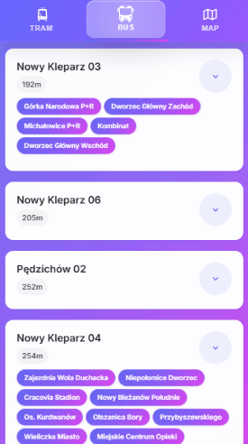

# Live Departures Backend

## 🌐 Live Demo

**Try the app: [https://live-departures.pages.dev/](https://live-departures.pages.dev/)**


<p align="center">
  
  &nbsp;
  &nbsp;
  &nbsp;
  &nbsp;
  &nbsp;
  &nbsp;
  
</p>

## 🌐 Related Projects

- **Frontend**: [live-departures](https://github.com/lukasznidecki/live-departures) - PWA Angular App
- **Infrastructure**: [live-departures-infra](https://github.com/lukasznidecki/live-departures-infra) - Deployment and
  infrastructure configuration

## 🚀 Features

- **Real-time vehicle tracking** - GPS coordinates and status of active vehicles
- **Stop information** - Bus and tram stops with coordinates
- **Departure times** - Current and predicted departure/arrival times
- **Vehicle fleet data** - Complete information about all vehicles
- **OpenAPI/Swagger documentation** - Interactive API documentation

## 🛠 Tech Stack

- **Java 21** - Modern Java with latest features
- **Quarkus 3.6** - Supersonic subatomic Java framework
- **RESTEasy Reactive** - High-performance REST endpoints
- **Jackson** - JSON serialization/deserialization
- **SmallRye OpenAPI** - API documentation and Swagger UI
- **Maven** - Dependency management and build tool
- **Helm** - Kubernetes deployment and package management

## 📋 API Endpoints

| Method | Endpoint                               | Description                                     |
|--------|----------------------------------------|-------------------------------------------------|
| `GET`  | `/api/vehicles`                        | Get all vehicles in the fleet                   |
| `GET`  | `/api/vehicles/active/gtfs`            | Get active vehicles with real-time GPS data     |
| `GET`  | `/api/stops`                           | Get all bus and tram stops                      |
| `GET`  | `/api/stops/{stop}/current_stop_times` | Get current departure times for a specific stop |

## 🚦 Getting Started

### Prerequisites

- Java 21 or later
- Maven 3.8.1 or later

### Development

```bash
# Clone the repository
git clone <repository-url>
cd live-departures-backend

# Run in development mode (with live reload)
./mvnw quarkus:dev
```

The application will start on `http://localhost:8080`

### API Documentation

- **Swagger UI**: http://localhost:8080/swagger-ui
- **OpenAPI Spec**: http://localhost:8080/q/openapi

### Building

```bash
# Create JAR package
./mvnw clean package

# Run the JAR
java -jar target/quarkus-app/quarkus-run.jar
```

### Native Build

```bash
# Build native executable
./mvnw package -Pnative

# Run native executable
./target/live-departures-backend-1.0.0-SNAPSHOT-runner
```

## 🧪 Testing

```bash
# Run unit tests
./mvnw test

# Run with coverage
./mvnw verify
```

## 🔧 Configuration

Configuration is handled through `src/main/resources/application.properties`:

```properties
# Server configuration
quarkus.http.port=8080
quarkus.http.cors=true
quarkus.http.cors.origins=*
# OpenAPI configuration
quarkus.smallrye-openapi.info-title=Live Departures API
quarkus.smallrye-openapi.info-version=1.0.0
quarkus.swagger-ui.always-include=true
quarkus.swagger-ui.path=/swagger-ui
```

## 🚀 Deployment

This backend is deployed using the infrastructure defined
in [live-departures-infra](https://github.com/lukasznidecki/live-departures-infra).

### Production Deployment

The application is automatically deployed using the infrastructure configuration. See
the [live-departures-infra](https://github.com/lukasznidecki/live-departures-infra) repository for deployment details
and environment setup.

### Manual Deployment

```bash
# Build production JAR
./mvnw clean package -DskipTests

# Deploy JAR file
java -jar target/quarkus-app/quarkus-run.jar
```

### GitHub Actions

The project includes CI/CD workflows:

- **CI Pipeline**: Runs tests and builds on every push/PR
- **Release Pipeline**: Creates GitHub releases when tags are pushed

```bash
# Create a release
git tag v1.0.0
git push origin v1.0.0
```

## 📚 API Examples

### Get Active Vehicles

```bash
curl http://localhost:8080/api/vehicles/active/gtfs
```

### Get Stop Information

```bash
curl http://localhost:8080/api/stops
```

### Get Stop Times

```bash
curl http://localhost:8080/api/stops/01/current_stop_times
```


